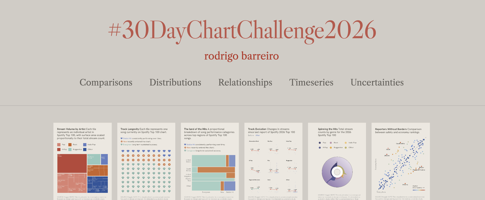

My submissions for the [#30DayChartChallenge](https://github.com/30DayChartChallenge). Mixing insight with aesthetics, caffeine optional but recommended.

> [!IMPORTANT]  
> 👉 Check out the full plot gallery on the website!
> https://barreiro-r.github.io/30-day-chart-challenge/

## 2025 Edition 

| Comparisons                                                          | Distributions                                             | Relationships          | Timeseries                                      | Uncertainties                           |
|----------------------------------------------------------------------|-----------------------------------------------------------|------------------------|-------------------------------------------------|-----------------------------------------|
| 01. Fractions                         | 07. Outliers              | 13. Clusters    | 19. Smooth                                      | 25. Risk                                |
| 02. Slope                             | 08. Histogram             | 14. Kinship              | 20. Urbanization                                | 26. Monochrome                          |
| 03. Circular                          | 09. Diverging             | 15. Complicated          | 21. Fossils                                      | 27. Noise                               |
| 04. Big or Small                      | 10. Multi-modal          | 16. Negative   | 22. Stars                                       | 28. Inclusion                           |
| 05. Ranking                           | 11. Stripes              | 17. Birds    | 23. Log Scale                                   | 29. Extraterrestrial                    |
| 06. Florence Nightingale (theme day)  | 12. Data.gov (data day)  | 18. El Pais (theme day) | 24. World Health Organization (data day)        | 30. National Geographic (theme day)     |