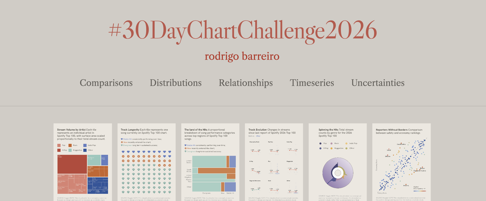

My submissions for the [#30DayChartChallenge](https://github.com/30DayChartChallenge). Mixing insight with aesthetics, caffeine optional but recommended.

> [!IMPORTANT]  
> 👉 Check out the full plot gallery on the website!
> (I'm still working on the 2026 edition website)
> https://barreiro-r.github.io/30-day-chart-challenge/

## 2026 Edition 

| Comparisons                                                          | Distributions                                             | Relationships                                           | Timeseries                                                                      | Uncertainties                                                           |
|----------------------------------------------------------------------|-----------------------------------------------------------|---------------------------------------------------------|---------------------------------------------------------------------------------|-------------------------------------------------------------------------|
| 01. Part-to-Whole                         | 07. Multiscale              | 13. Ecosystems             | 19. Evolution                                      | 25. Space                                |
| 02. Pictogram                             | 08. Circular             | 14. Trade              | 20. Global Change                                 | 26. Trend                          |
| 03. Mosaic                          | 09. Wealth             | 15. Correlation          | 21. Historical                                     | 27. Animation                               |
| 04. Slope                      | 10. Pop Culture          | 16. Causation             | 22. New Tool                                       | 28. Modeling                           |
| 05. Experimental                           | 11. Physical              | 17. Remake                | 23. Seasons                                   | 29. Monochrome                    |
| 06. Reporters Without Borders(Data day)  | 12. FlowingData (Theme day)  | 18. UNICEF (Data day)  | 24. South China Morning Post (Theme day)        | 30. Global Health Data Exchange (Data day)     |

## 2025 Edition 

| Comparisons                                                          | Distributions                                             | Relationships                                           | Timeseries                                                                      | Uncertainties                                                           |
|----------------------------------------------------------------------|-----------------------------------------------------------|---------------------------------------------------------|---------------------------------------------------------------------------------|-------------------------------------------------------------------------|
| 01. Fractions                         | 07. Outliers              | 13. Clusters             | 19. Smooth                                      | 25. Risk                                |
| 02. Slope                             | 08. Histogram             | 14. Kinship              | 20. Urbanization                                | 26. Monochrome                          |
| 03. Circular                          | 09. Diverging             | 15. Complicated          | 21. Fossils                                     | 27. Noise                               |
| 04. Big or Small                      | 10. Multi-modal          | 16. Negative             | 22. Stars                                       | 28. Inclusion                           |
| 05. Ranking                           | 11. Stripes              | 17. Birds                | 23. Log Scale                                   | 29. Extraterrestrial                    |
| 06. Florence Nightingale (theme day)  | 12. Data.gov (data day)  | 18. El Pais (theme day)  | 24. World Health Organization (data day)        | 30. National Geographic (theme day)     |