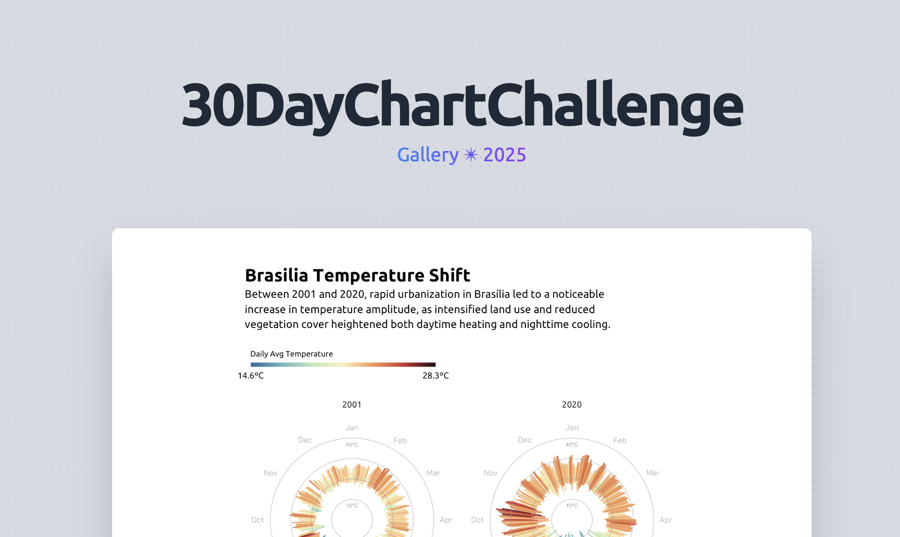

My submissions for the [#30DayChartChallenge](https://github.com/30DayChartChallenge). Mixing insight with aesthetics, caffeine optional but recommended.

## 2025 Edition 

| Comparisons           | Distributions        | Relationships        | Timeseries               | Uncertainties                   |
|-----------------------|----------------------|-----------------------|--------------------------|----------------------------------|
| 01. Fractions          | 07. Outliers         | 13. Clusters          | 19. Smooth               | 25. Risk                         |
| 02.Slope  | 08. Histogram        | 14. Kinship           | 20. Urbanization         | 26. Monochrome                   |
| 03. Circular  | 09. Diverging        | 15. Complicated       | 21. Fossils              | 27. Noise                        |
| 04. Big or Small  | 10. Multi-modal      | 16. Negative          | 22. Stars                | 28. Inclusion                    |
| 05. Ranking  | 11. Stripes          | 17. Birds             | 23. Log Scale            | 29. Extraterrestrial             |
| 06. Florence Nightingale (theme day) | | 12. Data.gov (data day) | 18. El Pais (theme day) | 24. World Health Organization (data day) | 30. National Geographic (theme day) |